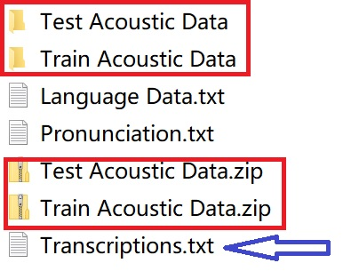
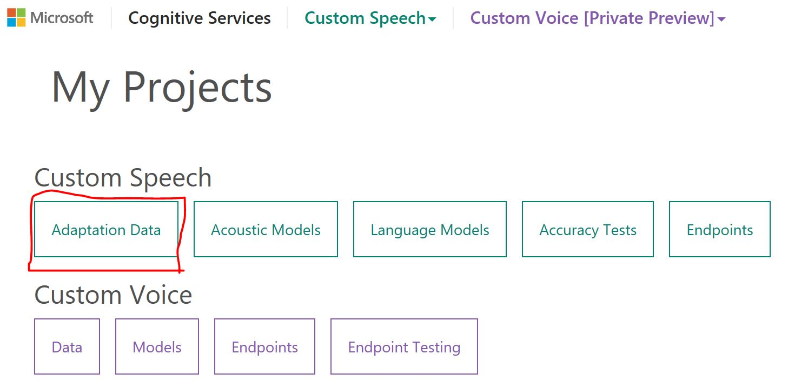
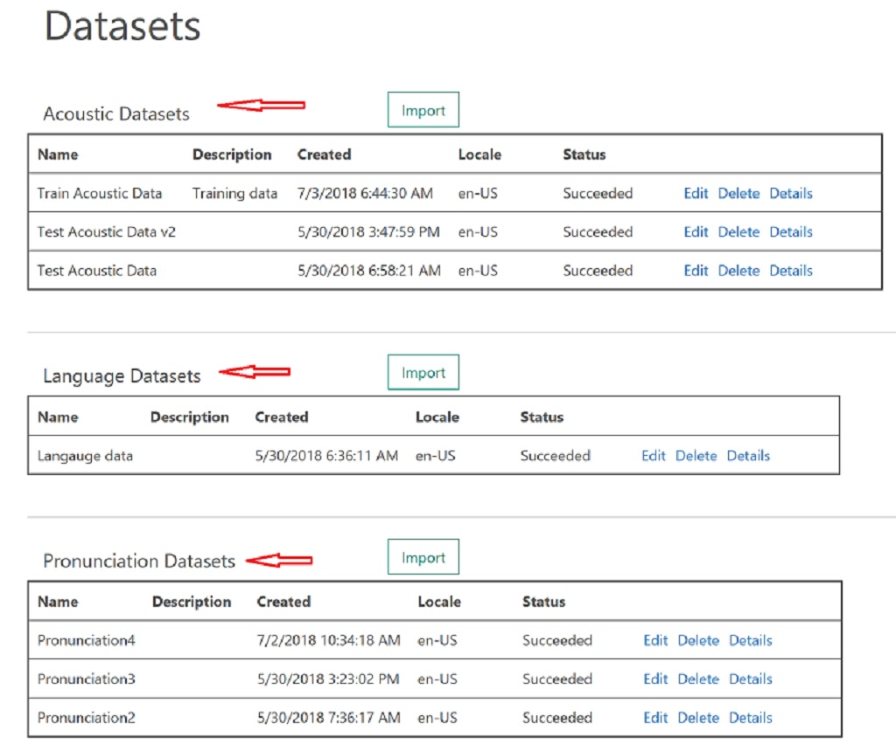
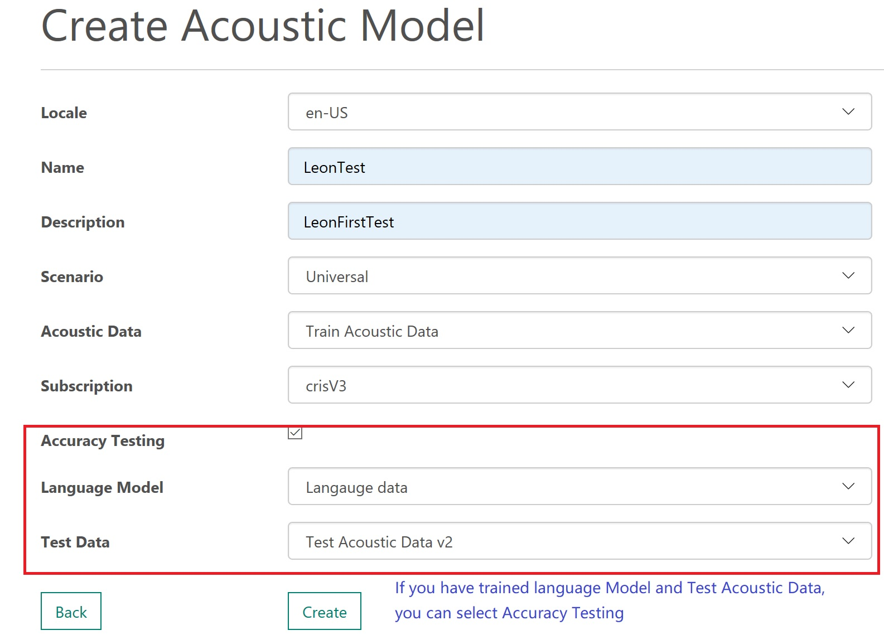
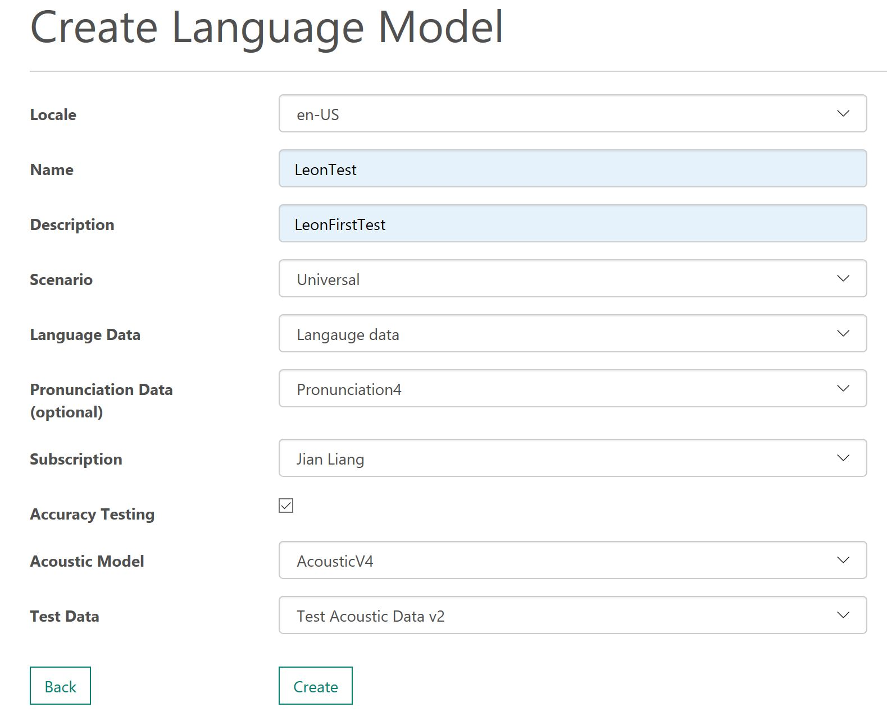
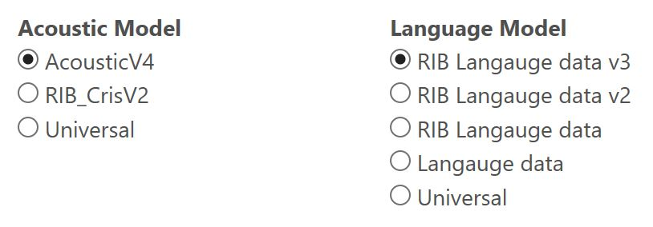
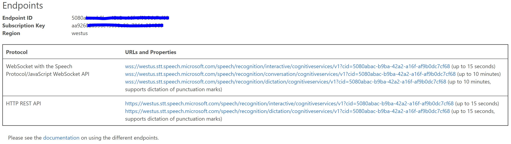
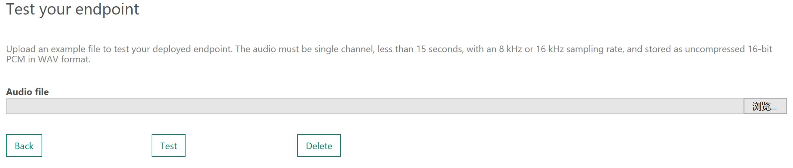

#  Build your Custom Speech Model by Microsoft Azure Cognitive Service - Custom Speech Service

## Background

Microsoft Cognitive Services provide a new speech - <a href="https://cris.ai/Home/CustomSpeechCustom" target="_blank"> Custom Speech Service</a>, besides general Speech to Text (STT) and Text to Speech (TTS). With Custom Speech Service, you can build your own customized STT model based on your training data and scenarios. This Custom Speech Model can better recognize specific tones, speaking environments, vocabularies, and special pronunciations. Custom Speech is a very useful service. Let's take a look at how to use Custom Speech to build your own speech recognition model.

## Prerequisites

* In this example, we will use Visual Studio 2017 to develop a sample application to call and test the Custom Speech Module. If you don't have VS2017, please install firstly.
* If you haven't created Speech Service, please create the service with this <a href="https://azure.microsoft.com/en-us/try/cognitive-services/" target="_blank">link</a>.
* Please prepare for a application that use the Custom Speech REST API to test and show the result, the application can be Mobile App, Web App, WeChat App or IoT App etc.
* Prepare training data datasets for Custom Speech Service, such as Acoustic (Audio File), Language, Pronunciation. About Custom Speech training dataset, please refer to <a href="https://docs.microsoft.com/en-us/azure/cognitive-services/speech-service/how-to-customize-speech-models" target="_blank">link</a>

## Training the model
Firstly, we need tp get to know the types of data and scenarios that Custom Speech Service can support. Currently, Custom Speech Service supports 3 types of dataset.

* Acoustic Datasets  
An acoustic dataset for customizing the acoustic model consists of two parts: (1) a set of audio files containing the speech data and (2) a file containing the transcriptions of all audio files.

For example, if you want to have better speech recognition in noisy environments, the audio file for training should include the speaker's voice in a noisy environment. If you also want to get better recognition with the speaker's accent and specific vocabularies, in the trained sound file, it is also necessary to include the pronunciation of special sentences and vocabularies. This collection can range from a couple of utterances to several hundred hours of speech. The collection consists of a set of audio files of speech data, and a text file of transcriptions of each audio file. The audio data should be representative of the scenario in which you want to use the recognizer.

**Please read the requirement of Audio data <a href="https://docs.microsoft.com/en-us/azure/cognitive-services/Speech-Service/how-to-customize-acoustic-models#audio-data-recommendations" target="_blank">Audio data recommendations</a>**
Build Transcriptions for Audio dataset， please refer to： <a href="https://docs.microsoft.com/en-us/azure/cognitive-services/Speech-Service/how-to-customize-acoustic-models#transcriptions-for-the-audio-dataset" target="_blank">Transcriptions for Audio dataset</a>  

  Firstly, we need to record the Audio file according to **Audio file requirement**, saving the wave file in the "Train Acoustic Data" directory, and then the zip the directory to Train Acoustic Data.zip. Please prepare for additional audio files as Test Acoustic Data. After that, create a transcription file for each training and test wave file, each line of the transcription file should contain the name of one of the audio files, followed by the corresponding transcription. Please note that the audio is less than 60 secs in each audio file. Please do not record more than one sentence in a wave file. Please refer to following example

    speech01.wav  speech recognition is awesome
    speech02.wav  the quick brown fox jumped all over the place
    speech03.wav  the lazy dog was not amused

  Please prepare for the files like:  
  

* Language Datasets
Giving some examples of text formatting to make the model better recognize and convert text from Speech. For example, Capital Letter, hyphens, specific formats. For example: the user says "fourteen northeast third drive"，the expected recogniztion result is "14 NE 3rd Dr". Please put the language training data into Language Data.txt. Please refer to the data format: <a href="https://docs.microsoft.com/en-us/azure/cognitive-services/Speech-Service/how-to-customize-language-model#prepare-the-data" target="_blank">prepare the language data</a>

* Pronunciation Datasets  
Provide some special text, pronunciation of the vocabulary. In the dataset, you need to define how to pronounce. For example: "McTwo" is marked to "mike two" **Please note: in Pronunciation.txt Display form and Spoken form should be separated by a <Tab>**

  McTWO mike two  
  McTWO mike tool  
  McTWO mark two  
  Hello McTWO hello mike two

About data type, please refer to <a href="https://docs.microsoft.com/en-us/azure/cognitive-services/speech-service/how-to-customize-speech-models" target="_blank">Create a custom acoustic model</a>, <a href="https://docs.microsoft.com/en-us/azure/cognitive-services/Speech-Service/how-to-customize-language-model" target="_blank">Create a custom language model</a> and <a href="https://docs.microsoft.com/en-us/azure/cognitive-services/Speech-Service/how-to-customize-pronunciation" target="_blank">Enable custom pronunciation</a>

### Upload Dataset：

In <a href="https://cris.ai" target="_blank"> Custom Speech Service Portal</a> select "Adaptation Data" 

Upload your Acoustic data，Language and Pronunciation data, to corresponding Dataset

Upload Transcriptions and Audio file in "Import Acoustic Data", then upload the Language and Pronunciation Data. **If there isn't the requirement of acoustic recogniztion in your scenarios, you don't need to upload acoustic data. You can select the corresponding training and test data according to your scenario.**

### Create Models：
You can choose to create an Acoustic Model or a Language Model. Select Acoustic Models from the Custom Speech drop-down menu and select "Create New" on the page, where you can choose your own training Acoustic Data. In the Accuracy Testing option, if you have a trained Language Model and Test Acoustic Data, you can select it and test it. If not, please ignore it.

To create the Language Model, select Language Models from the Custom Speech drop-down menu and select "Create New" on the page, where you can choose your own training Language Data and Pronunciation Data. In the Accuracy Testing option, if you have a trained Acoustic Model and Test Acoustic Data, you can select it and test it. If not, please ignore it.

If the training result is failed, please check if the training data formats meet the requirements. For example: check if Audio File is wave mono，check bitrate value. You can create a new Accuracy Test from "Accuracy Test Results" and also check previous test results.

### Deployment model and generate Endpoint：
After models are ready, you can create your own Custom Speech Endpoints. Select "Endpoints" from the Custom Speech drop-down menu and select "Create New" from the page. You can select both the trained Acoustic Model and the Language Model, or you can select a specific Acoustic or Language Model.
  

 After the deployment is completed, you can find the specific Endpoint ID, Subscription Key, REST API, WSS link, etc. through the "Detail" option. With the Rest API, you can consume your own Custom Speech model directly
  

 In the Endpoint page, you can also directly upload a wave file to quickly test with your model.
  

### Use Custom Speech Model in application：
Once your custom speech model is ready, you can use it in your applications. You can access it through the REST API and the Websocket API. In face, comparing with general Speech Service API, there is one more parameter - Deployment ID (a.k.a Endpoint ID) Custom Speech model API, so you can use the Speech SDK with small changes.

In this example, let's use Custom Speech Model API in a Windows App. Firstly, put the subscription key of Speech Service to function - RecognitionWithMicrophoneAsync

    var factory = SpeechFactory.FromSubscription("YourSubscriptionKey", "YourServiceRegion");

Secondly，we need to configure the parameter of Custom Speech Model. In Function - RecognitionUsingCustomizedModelAsync besides setting subscriptionKey，we set DeploymentID (a.k.a Endpoint ID）

    // Replace with the CRIS deployment id of your customized model.
    recognizer.DeploymentId = "YourDeploymentId";

After compiling, run the app, Option 1 for general Speech Service, Option 4 for using Custom Speech Endpoint. The following is a different recognition result for same word "Mctwo"
 

This Windows App sample code can be found in the folder "crisWinAppDemo" and please also refer to <a href="https://github.com/Azure-Samples/cognitive-services-speech-sdk/tree/master/Windows/csharp_samples" target="_blank">link</a>

## References

**Custom Speech Service**

* Custom Speech Service <a href="https://cris.ai/" target="_blank">Portal</a>
* Custom Speech Service Document <a href="https://docs.microsoft.com/zh-cn/azure/cognitive-services/speech-service/how-to-customize-speech-models" target="_blank">Link</a>
* Custom Speech Service Windows App <a href="https://github.com/Azure-Samples/cognitive-services-speech-sdk/tree/master/samples/csharp/dotnetcore/console" target="_blank">Link</a>